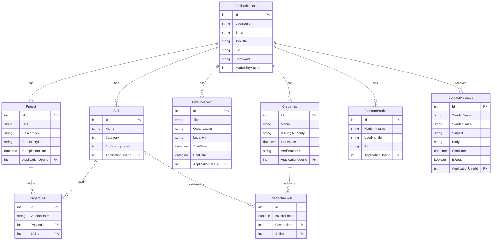

# Portfol.io


Portfol.io is a dynamic, centralized Content Management System (CMS) designed specifically for software engineers. It bypasses the limitations of static portfolio templates by providing a secure admin dashboard to manage and present a professional brand, including technical projects, skills, coding profiles, and career milestones.

This repository was developed as part of the Advanced Internet Computing course, supervised and evaluated by Dr. Salah Safi.

## Authors

- **[Abdallah Tahboub](https://github.com/abdullatahboub)**
- **[Yaman Alrifai](https://github.com/yamanalrfai)**
- **[Mohammed Alhamed](https://github.com/MoHAdMed1)**
- **[Yousef Al-Shishani](https://github.com/YousefKurchaloy)**

## Features

- **Admin CMS Dashboard:** Secure, authenticated backend for full CRUD operations on all portfolio content.
- **Dynamic Project Showcase:** Filter and display technical builds (e.g., APIs, mobile apps) dynamically linked to the technologies used to build them.
- **Skills Matrix:** Categorized representation of technical proficiencies (Backend, Frontend, AI, Systems, etc.).
- **Professional Timeline:** A chronological tracker for industry events, university milestones, and career experiences.
- **Platform Profiles Integration:** Dedicated section to highlight algorithmic problem-solving handles (e.g., Codeforces, AtCoder).
- **Visitor Contact System:** Front-end messaging form that feeds directly into the admin dashboard for easy recruiter communication.

## Database Architecture



The data model is managed via **Entity Framework Core** and utilizes comprehensive data annotations and schema configurations. Core entities include:

- **ApplicationUser:** The central entity of the architecture. It handles CMS authentication, profile data, and acts as the principal owner of all other records. A single user can have multiple projects, skills, timeline events, credentials, platform profiles, and contact messages (One-to-Many relationships).
- **Project & Skill (Many-to-Many):** Real-world projects utilize multiple technologies, and a specific skill can be applied across multiple projects. This is resolved through the explicit **ProjectSkill** join table, which also stores a payload column (`VersionUsed`) to track the specific version of the technology implemented in a project.
- **Credential & Skill (Many-to-Many):** Certain certifications and credentials validate specific technical proficiencies. This is mapped through the **CredentialSkill** explicit join table, which includes an `IsCoreFocus` boolean payload to highlight the primary skills associated with the credential.
- **TimelineEvent:** A chronological tracker that stores dates, locations, and organizational details for career and educational milestones.
- **Credential:** Stores verifiable achievements, issue dates, issuing authorities, and external validation links.
- **PlatformProfile:** Integrates competitive programming statistics and developer ranks (e.g., LeetCode, Codeforces, GitHub) directly to the user.
- **ContactMessage:** Securely stores visitor inquiries submitted through the front-end portfolio, linking them directly to the targeted `ApplicationUser`'s inbox.

## Getting Started

### Prerequisites

- [.NET 10.0 SDK](https://dotnet.microsoft.com/download) (or matching version)
- Visual Studio 2022 / JetBrains Rider / VS Code
- SQL Server

### Installation

1. **Clone the repository**
   ```bash
   git clone https://github.com/YousefKurchaloy/Portfol.io.git
   cd Portfol.io
   ```
2. **Update Database Connection**
   Configure your connection string in `appsettings.json`.

3. **Apply EF Core Migrations**
   Open your Package Manager Console or terminal and run:
   ```bash
   dotnet ef database update
   ```
4. **Run the Application**
   ```bash
   dotnet run
   ```
