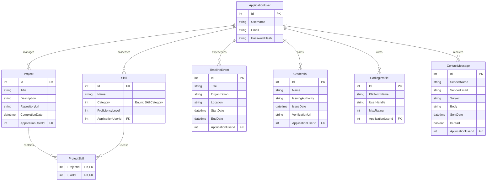

# Portfol.io


Portfol.io is a dynamic, centralized Content Management System (CMS) designed specifically for software engineers. It bypasses the limitations of static portfolio templates by providing a secure admin dashboard to manage and present a professional brand, including technical projects, skills, coding profiles, and career milestones.

This repository was developed as part of the Advanced Internet Computing course, supervised and evaluated by Dr. Salah Safi.

## Authors

* **[Abdallah Tahboub](https://github.com/abdullatahboub)**
* **[Yaman Alrifai](https://github.com/yamanalrfai)**
* **Mohammed Alhamed**
* **[Yousef Al-Shishani](https://github.com/YousefKurchaloy)**
  

## Features

* **Admin CMS Dashboard:** Secure, authenticated backend for full CRUD operations on all portfolio content.
* **Dynamic Project Showcase:** Filter and display technical builds (e.g., APIs, mobile apps) dynamically linked to the technologies used to build them.
* **Skills Matrix:** Categorized representation of technical proficiencies (Backend, Frontend, AI, Systems, etc.).
* **Professional Timeline:** A chronological tracker for industry events, university milestones, and career experiences.
* **Coding Profiles Integration:** Dedicated section to highlight algorithmic problem-solving handles (e.g., Codeforces, AtCoder).
* **Visitor Contact System:** Front-end messaging form that feeds directly into the admin dashboard for easy recruiter communication.

## Database Architecture

The data model is managed via **Entity Framework Core** and utilizes comprehensive data annotations and schema configurations. Core entities include:



The data model is managed via **Entity Framework Core** and utilizes comprehensive data annotations and schema configurations. Core entities include:

* **ApplicationUser:** Handles CMS authentication.
* **Project & Skill:** Connected via a **Many-to-Many** relationship, reflecting how real-world projects utilize multiple technologies, and specific skills apply to multiple projects.
* **TimelineEvent:** Tracks dates, locations, and details for professional milestones.
* **Credential:** Verifiable achievements and certificates.
* **CodingProfile:** Competitive programming statistics.
* **ContactMessage:** securely stores visitor inquiries.

## Getting Started

### Prerequisites
* [.NET 10.0 SDK](https://dotnet.microsoft.com/download) (or matching version)
* Visual Studio 2022 / JetBrains Rider / VS Code
* SQL Server

### Installation

1. **Clone the repository**
   ```bash
   git clone https://github.com/YousefKurchaloy/Portfol.io.git
   cd Portfol.io
   ```
2. **Update Database Connection**
   Configure your connection string in ```appsettings.json```.

4. **Apply EF Core Migrations**
   Open your Package Manager Console or terminal and run:
   ```bash
   dotnet ef database update
   ```
5. **Run the Application**
   ```bash
   dotnet run
   ```
